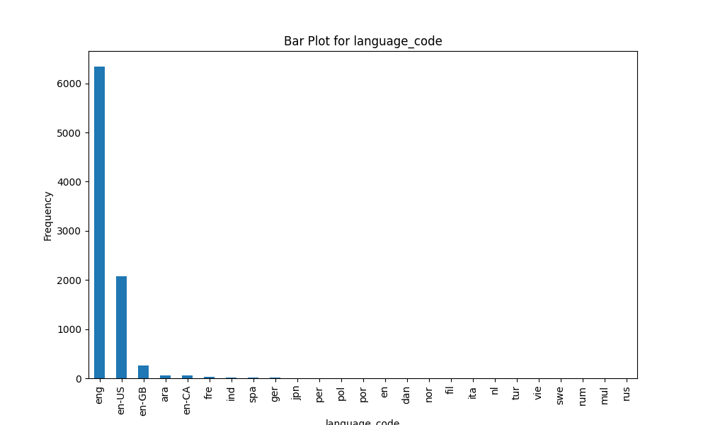

# Automated Data Analysis Report

## Dataset Summary
- Shape: (10000, 23)
- Columns: book_id, goodreads_book_id, best_book_id, work_id, books_count, isbn, isbn13, authors, original_publication_year, original_title, title, language_code, average_rating, ratings_count, work_ratings_count, work_text_reviews_count, ratings_1, ratings_2, ratings_3, ratings_4, ratings_5, image_url, small_image_url
- Missing Values: {'book_id': 0, 'goodreads_book_id': 0, 'best_book_id': 0, 'work_id': 0, 'books_count': 0, 'isbn': 700, 'isbn13': 585, 'authors': 0, 'original_publication_year': 21, 'original_title': 585, 'title': 0, 'language_code': 1084, 'average_rating': 0, 'ratings_count': 0, 'work_ratings_count': 0, 'work_text_reviews_count': 0, 'ratings_1': 0, 'ratings_2': 0, 'ratings_3': 0, 'ratings_4': 0, 'ratings_5': 0, 'image_url': 0, 'small_image_url': 0}

## Insights from Analysis
Based on the provided dataset summary, here are some key insights and observations:

### General Overview
1. **Dataset Size**: The dataset contains 10,000 entries (books) with 23 attributes (features) for each book.

2. **Fields Overview**: 
   - The dataset includes various identifiers for books, such as `book_id`, `goodreads_book_id`, `best_book_id`, and `work_id`.
   - It covers attributes relevant to books like title, authors, publication year, ratings, and images.

### Missing Values
3. **Missing Data**: There are several columns with missing values:
   - `isbn`: 700 missing entries.
   - `isbn13`: 585 missing entries.
   - `original_publication_year`: 21 missing entries.
   - `original_title`: 585 missing entries.
   - `language_code`: 1084 missing entries.
   These columns could be crucial for tasks like book identification and language analysis, indicating that data imputation or handling techniques may be necessary before further analysis.

### Data Types
4. **Data Types Representation**: 
   - Most entries use `int64` and `float64`, suggesting numeric data which is well-suited for analytical operations.
   - Some columns, such as `authors`, `original_title`, and `title` are of object type (string), indicating categorical data which may require encoding for certain types of analysis.

### Rating Analysis
5. **Average Ratings**:
   - The `average_rating` field reveals a range of book ratings from approximately 3.57 to 4.44 in the sample. This indicates generally favorable ratings.
   - The ratings distributions across `ratings_1`, `ratings_2`, `ratings_3`, `ratings_4`, and `ratings_5` suggest a significantly skewed distribution toward higher ratings for most titles, which could be a sign of a self-selected reader base (likely more engaged readers with a preference for popular books).

6. **Ratings Counts**: 
   - The `ratings_count` field varies significantly across books, with the top books having millions of ratings. This suggests a high engagement level with popular titles.

### Publication Year Insights
7. **Publication Year**:
   - The `original_publication_year` gives insights into the distribution of book releases. The presence of older titles (e.g., "To Kill a Mockingbird" published in 1960) along with modern classics (e.g., "Harry Potter" in 1997 and "The Hunger Games" in 2008) hints at a mix of historical and contemporary literature. Analyzing this field can reveal trends over time in genre popularity, author emergence, and reader preferences.

### Author Representation
8. **Author Distribution**:
   - Authors such as Suzanne Collins and J.K. Rowling appear in this dataset, showing the inclusion of popular contemporary authors. It would be valuable to analyze how many books are associated with a single author, indicating prolificacy.

### Language Code Analysis
9. **Language Coverage**:
   - The `language_code` field indicates the languages in which books are available. The high number of missing values (1084) in this field suggests a lack of comprehensive language metadata, which may affect non-English book analysis.

### Visual Insights
10. **Image URLs**:
    - The dataset contains URLs to images, allowing for potential visual analysis of covers, which could be correlated with ratings or reviews in a more detailed analysis.

### Conclusion
This dataset appears to be rich in information regarding popular literature, authors, and their reception among readers. However, the substantial amount of missing data in several key fields needs addressing for any rigorous statistical or machine-learning application. 

Further exploratory data analysis (EDA) would be recommended to extract deeper insights, trends, and relationships within this dataset, particularly focusing on filling in missing values and assessing the distribution of ratings in connection with book attributes (e.g., publication year, author popularity).

## Visualizations

