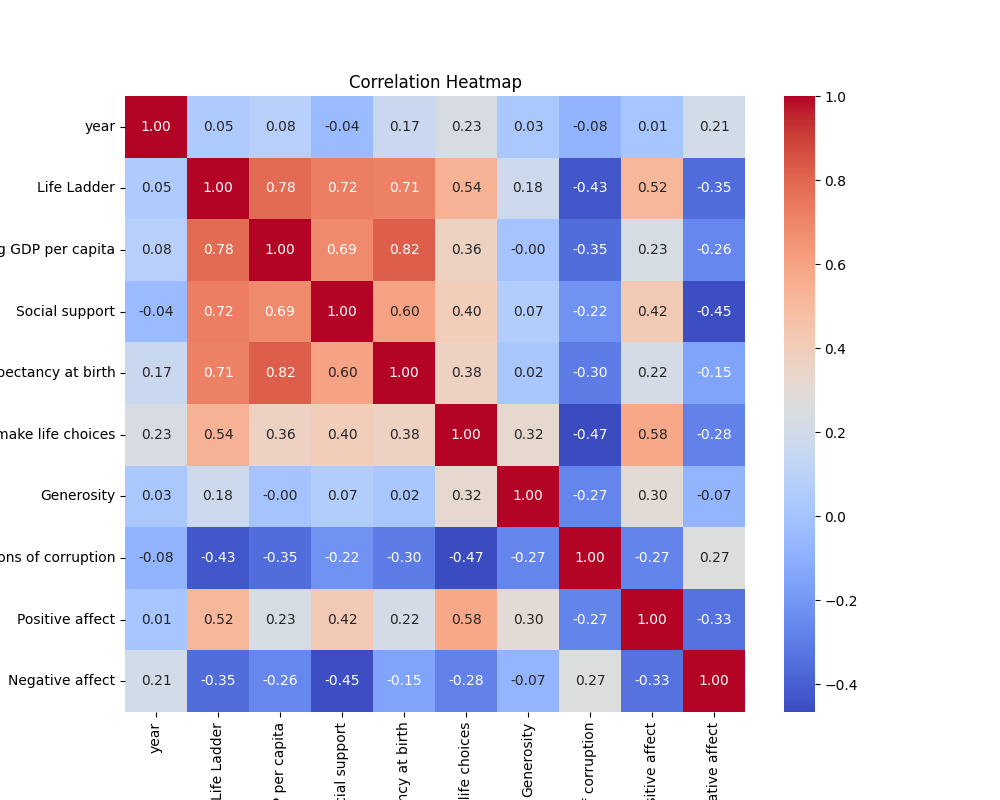
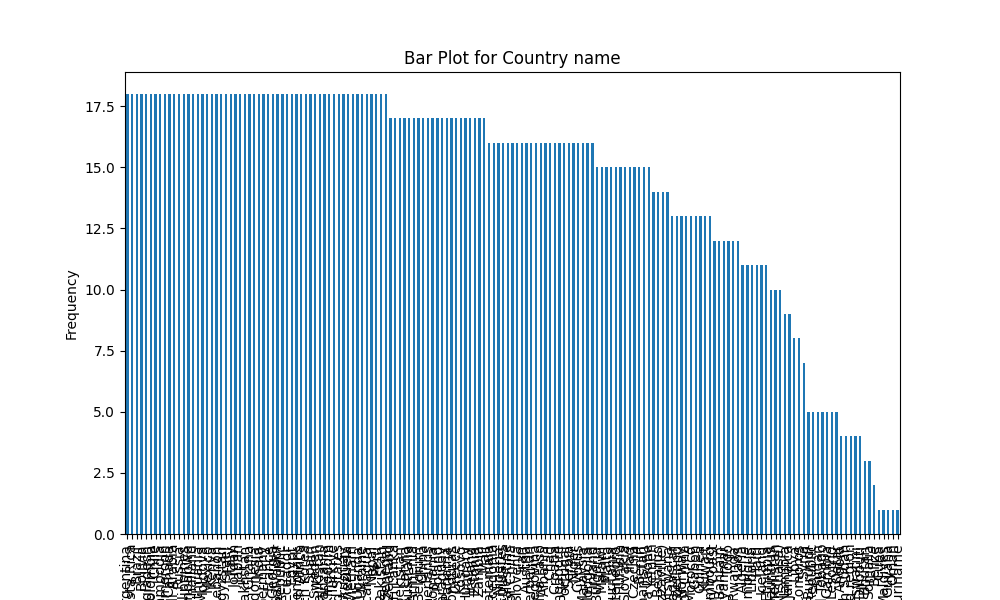

# Automated Data Analysis Report

## Dataset Summary
- Shape: (2363, 11)
- Columns: Country name, year, Life Ladder, Log GDP per capita, Social support, Healthy life expectancy at birth, Freedom to make life choices, Generosity, Perceptions of corruption, Positive affect, Negative affect
- Missing Values: {'Country name': 0, 'year': 0, 'Life Ladder': 0, 'Log GDP per capita': 28, 'Social support': 13, 'Healthy life expectancy at birth': 63, 'Freedom to make life choices': 36, 'Generosity': 81, 'Perceptions of corruption': 125, 'Positive affect': 24, 'Negative affect': 16}

## Insights from Analysis
Based on the provided dataset summary, here are the key insights and points of analysis:

### Dataset Overview:
- **Shape**: The dataset contains 2,363 rows (countries per year) and 11 columns (variables).
- **Columns**: The columns span various socio-economic and psychological indicators like 'Life Ladder', 'Log GDP per capita', and 'Social support', among others.

### Data Types:
- All relevant columns except 'Country name' and 'year' are numeric. This suggests that the dataset is well-suited for statistical analysis and modeling.

### Missing Values:
- There are several columns with missing values, which could impact analyses:
  - 'Log GDP per capita' has 28 missing values.
  - 'Social support' has 13 missing values.
  - 'Healthy life expectancy at birth' has 63 missing values.
  - 'Freedom to make life choices' has 36 missing values.
  - 'Generosity' has 81 missing values (most significant missing entries).
  - 'Perceptions of corruption' has 125 missing values (largest missing entry).
  - 'Positive affect' has 24 missing values.
  - 'Negative affect' has 16 missing values.

### Trends and Analysis:
1. **Life Ladder**:
   - This appears to be a key measure of subjective well-being or life satisfaction. A longitudinal study might show trends over the years for specific countries.

2. **Economic Indicators**:
   - 'Log GDP per capita' can be analyzed in association with 'Life Ladder' to explore if there's a correlation between economic performance and happiness.
   - Missing values in this column may indicate inconsistencies or gaps in economic data reporting for some countries.

3. **Social Support**:
   - An essential factor in well-being, its correlation with 'Life Ladder' can provide insights into whether higher social support contributes positively to happiness.

4. **Health Indicators**:
   - 'Healthy life expectancy at birth' can be tied into the analysis of happiness as it may be influential in populations where health is a significant concern.

5. **Freedom and Corruption**:
   - Both ‘Freedom to make life choices’ and ‘Perceptions of corruption’ are critical elements. High perception of corruption could correlate with lower 'Life Ladder’ scores.

6. **Generosity and Affects**:
   - 'Generosity' is notably missing in many entries; however, its inclusion can further elucidate cultural aspects impacting happiness. 
   - Likewise, 'Positive affect' and 'Negative affect' scores provide insights into emotional well-being.

### Sample Data Insights:
- The sample data for Afghanistan shows fluctuations in well-being over years:
  - Significant variation in 'Life Ladder' scores indicates changing perceptions of life quality.
  - Increases in both 'Log GDP per capita' and 'Healthy life expectancy at birth' aligned with certain years, suggesting economic and health improvements.

### Potential Analyses to Consider:
- **Correlation Analysis**: Examine how each variable correlates with 'Life Ladder'. Are richer countries happier? Does higher social support correlate with higher life satisfaction?
- **Time-Series Analysis**: Explore changes in well-being over time in specific countries.
- **Missing Value Handling**: Consider how to deal with missing values—imputation, deletion, or focusing analyses only on countries with complete data might be options.
- **Comparative Analysis**: Compare countries based on the various metrics to identify outliers or patterns.

### Conclusion:
This dataset offers a rich foundation for analyzing the interplay between economic conditions, social structures, health, and perceived well-being. Addressing missing data appropriately will be crucial for accurate modeling and insights.

## Visualizations

