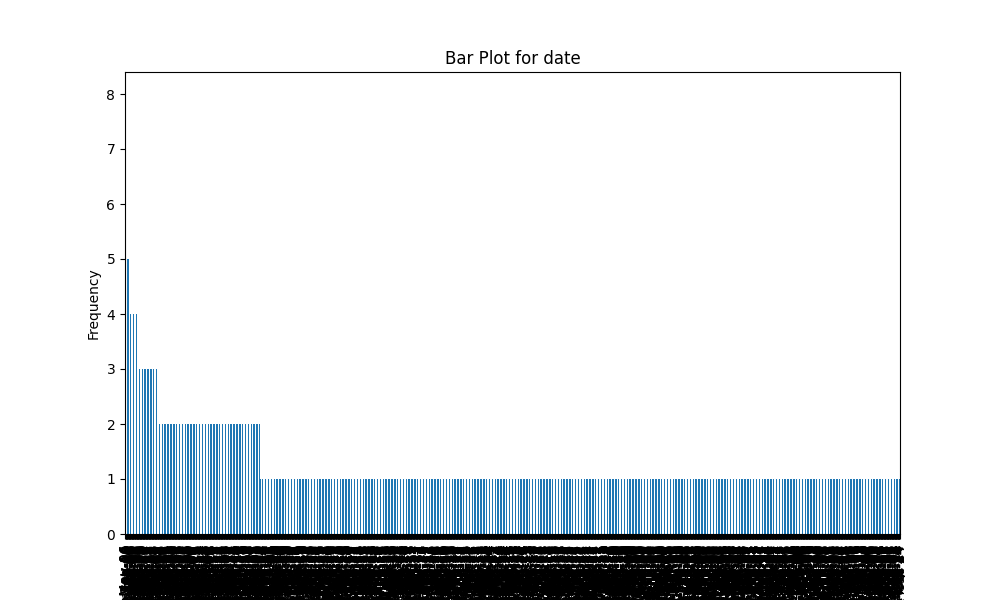
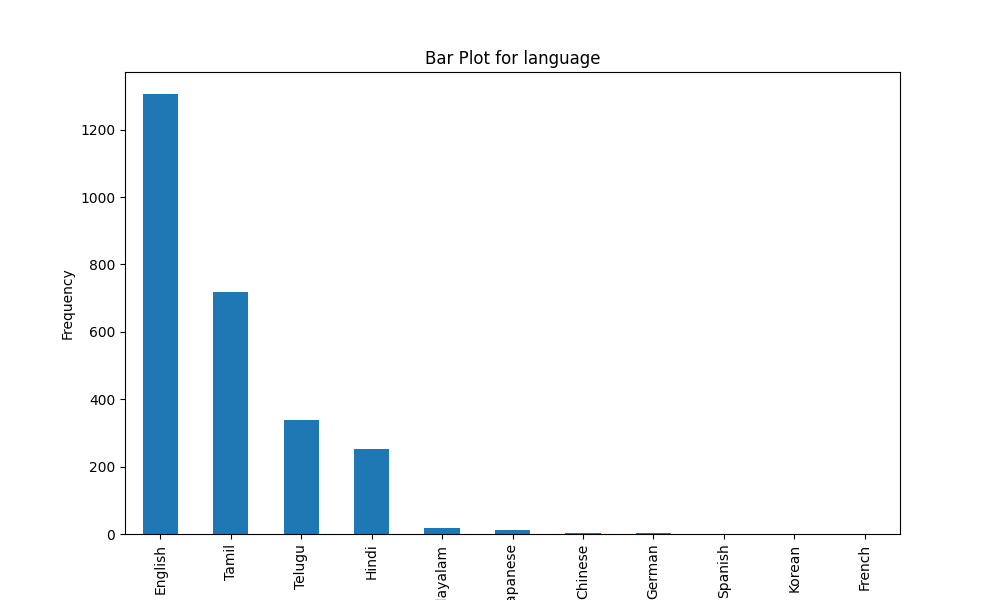
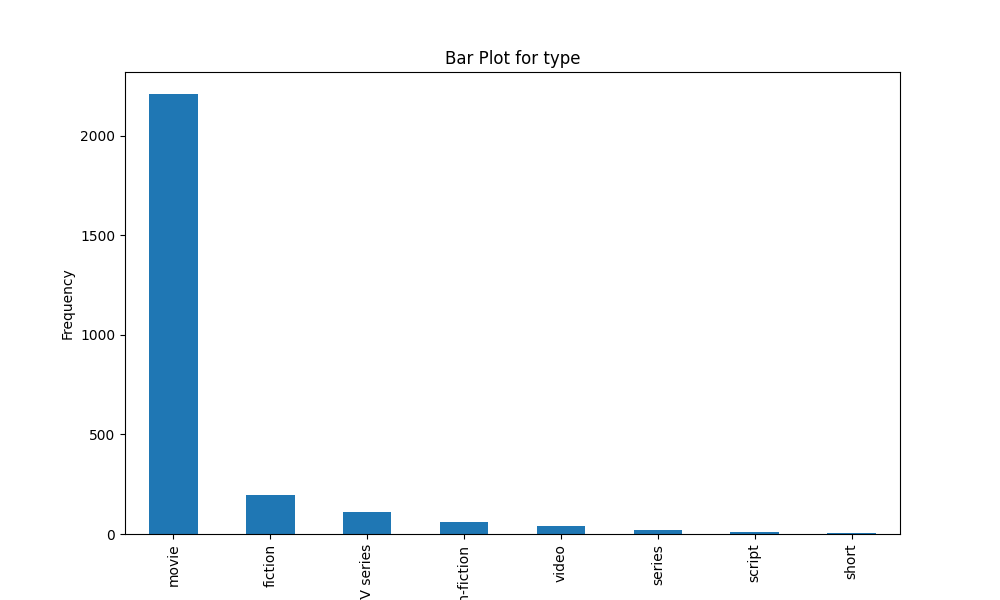
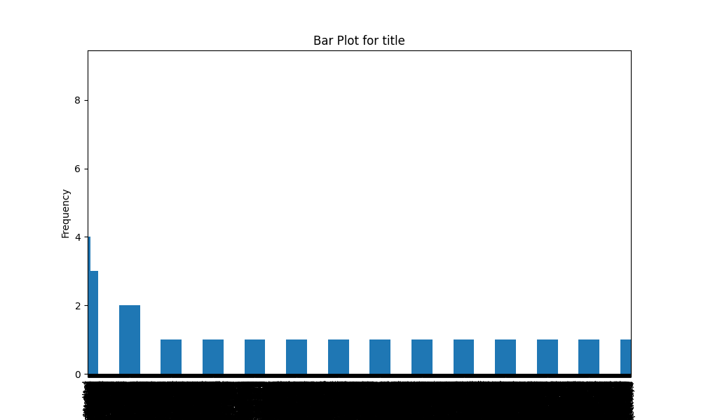
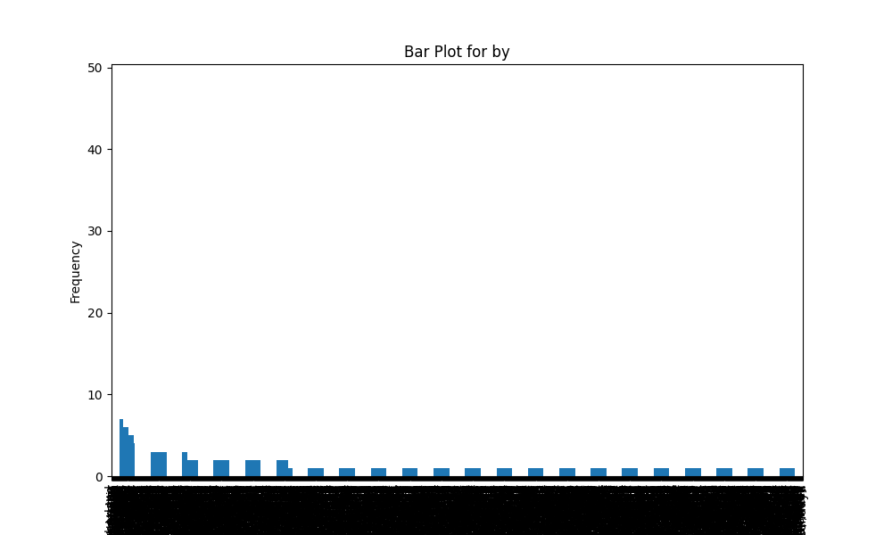

# Automated Data Analysis Report

## Dataset Summary
- Shape: (2652, 8)
- Columns: date, language, type, title, by, overall, quality, repeatability
- Missing Values: {'date': 99, 'language': 0, 'type': 0, 'title': 0, 'by': 262, 'overall': 0, 'quality': 0, 'repeatability': 0}

## Insights from Analysis
Based on the provided dataset summary, here are the key insights:

### Overview
- The dataset consists of **2652 records** across **8 features**.
- The columns include attributes related to movies, such as **date**, **language**, **type**, **title**, **by** (presumably the cast or creators), and metrics like **overall**, **quality**, and **repeatability**.

### Data Types
- The features have varied data types:
  - **date**: Object (likely a string format)
  - **language**: Object (categorical)
  - **type**: Object (categorical)
  - **title**: Object (categorical)
  - **by**: Object (categorical, may involve multiple names)
  - **overall**, **quality**, **repeatability**: Integers (suggesting ratings or scores)

### Missing Values
- There are **missing values**:
  - **99** missing values for the **date** column. This could affect time-series analysis or any date-based trends.
  - **262** missing values for the **by** column. This is significant since it could hinder the analysis of contributors or actors for the movies.
  - Other columns do not have missing values, which is beneficial for analysis.

### Sample Data
- The sample data reflects a diversity in movie titles, languages (primarily Tamil and Telugu), and an array of ratings:
  - Movies display ratings in **overall**, **quality**, and **repeatability** from **1 to 5** where higher numbers generally indicate better reviews.

### Insights on Ratings
- **Overall Ratings**:
  - Overall ratings vary from low (2) to high (4).
  - The general trend indicates a concentration of movies with decent ratings, but it would be beneficial to plot distributions to see if any trends exist, such as potential clustering around certain values.
  
- **Quality Ratings**:
  - Quality ratings mirror the overall ratings with scores from **2 to 5**.
  - A correlation analysis between overall ratings and quality could provide insights into whether higher quality correlates with better overall ratings.

### Language Distribution
- The sample consists solely of **Tamil** and **Telugu** movies suggesting a regional focus. An analysis on the distribution of languages may reveal preferences or trends based on language.

### Temporal Analysis
- The date format indicates movies might be released relatively recently, mainly in **October-November 2024**. Time-series analysis, once the dates are transformed into a datetime format, could help understand trends over this period.

### Potential Analysis Directions
1. **Trend Analysis**: Explore patterns based on movie release dates and how overall quality ratings change over time.
2. **Correlation Studies**: Assess relationships between overall ratings, quality, and repeatability to identify contributing factors to high ratings.
3. **Missing Data Strategies**: Consider methods to either fill or exclude missing data from the **date** and **by** columns for improved accuracy in predictions and insights.
4. **Content Analysis**: Review titles and contributors associated with high and low ratings to identify successful or failing patterns in movie production.

### Final Recommendations
- Clean the dataset focusing on handling missing values.
- Convert the **date** column to a proper datetime format for better analysis.
- Conduct a thorough exploratory data analysis (EDA) to uncover deeper insights into movie ratings, trends, and more comprehensive audience preferences.

## Visualizations

